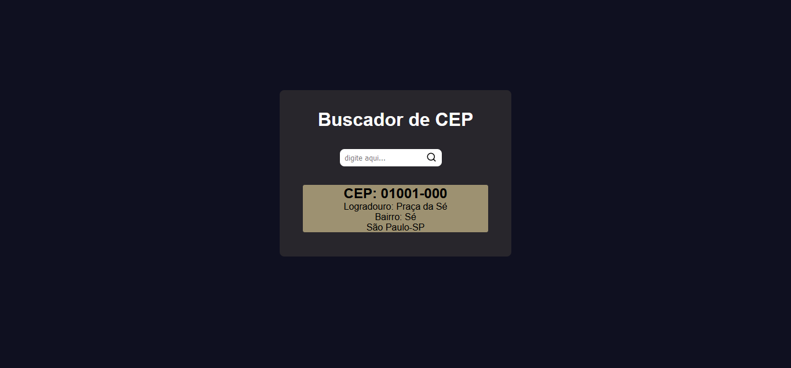

<h1 align="center">
  
</h1>

<h1 align="center">CEP</h1>

  

  

  

  

 

## 💻 Projeto

Projeto de um buscador de cep feito em ReactJs com TypeScript, foi utilizado a api VIACEP que foi consumida com o axios.

 

## 🌐 Preview

<h1 align="center">
    
    
</h1>

## 🚀 Tecnologias

Esse projeto foi desenvolvido com as seguintes tecnologias:

- [React](https://reactjs.org)
- [Typescript](https://www.typescriptlang.org/)
- [Styled Components](https://styled-components.com/)
- [Axios](https://www.devmedia.com.br/consumindo-uma-api-com-react-js-e-axios/42900)

 

  Made with 💙 by <a href="https://www.linkedin.com/in/natan-xavier-a266a0228/"> Natan Xavier </a>

